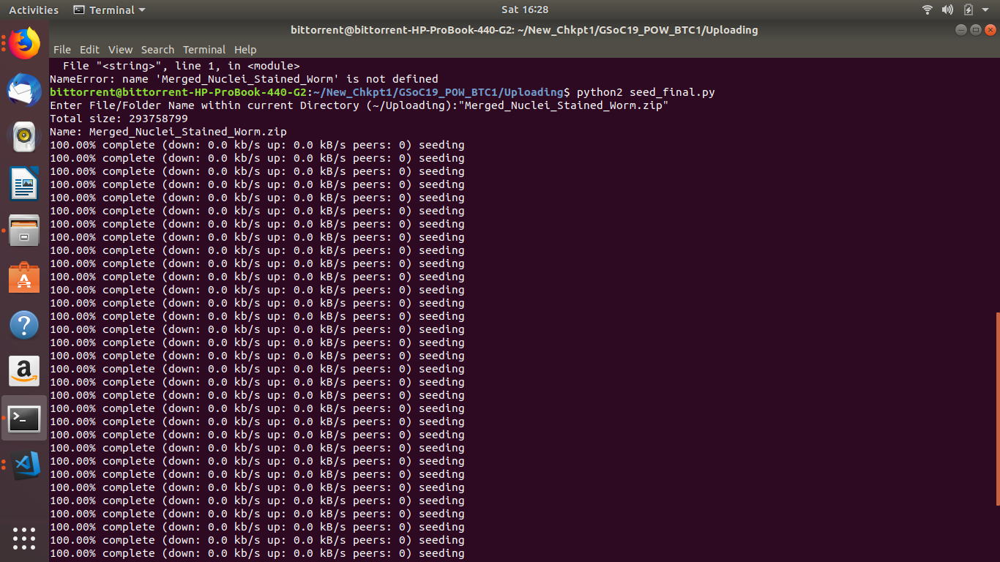
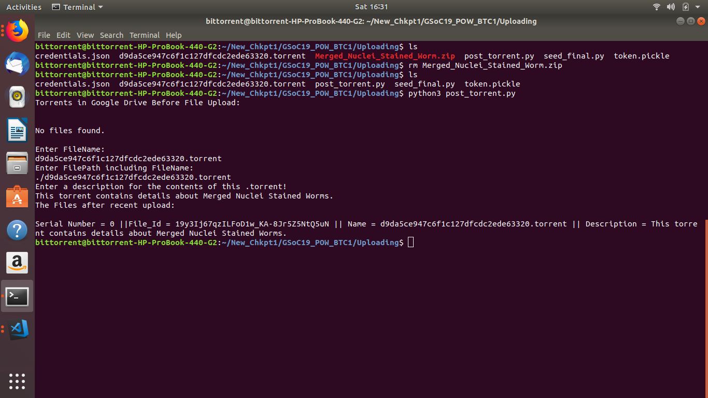
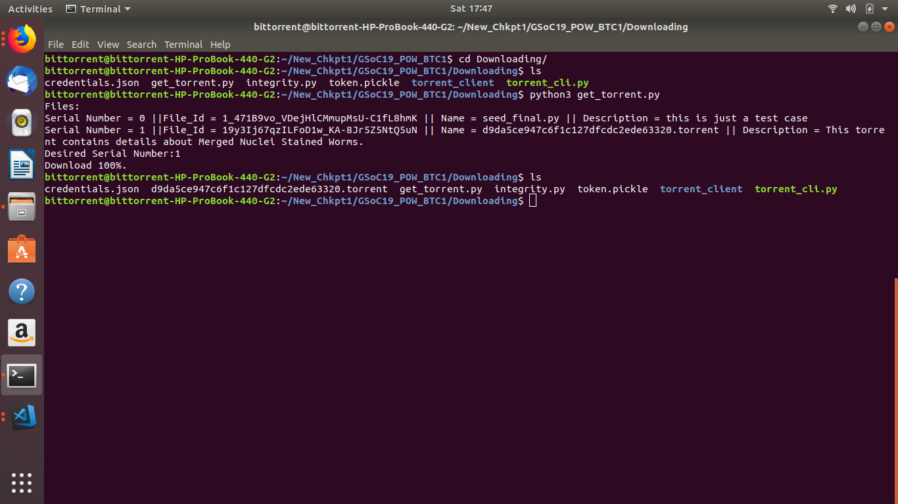
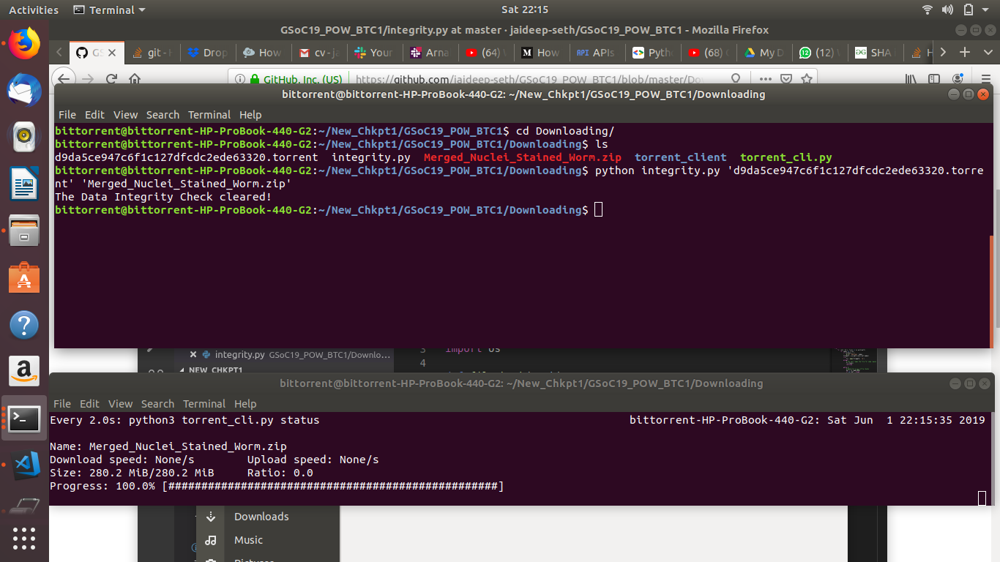

# GSoC 19 POW BitTorrent Client:

A BitTorrent Client to **create**, **seed** and **download** studies of C. Elegans through torrents. This Framework has built in **Data Integrity Checks** and utilizes **Google Drives** to View, Download and Upload desired .torrent files!

## Getting Started

This will guide you through setting up this Framework, this repository is split into **2 parts**: [All functionality via Command Line Interface]

#### 1) Uploading:
This involves **generating the Message Digest** for Data integrity checks, **creating torrents** and **seeding their contents** to other BitTorrent peers. The torrents are then **posted to Google Drives** from where they can be searched/accessed **based on descriptions that you provide** for independent researchers.

#### 2) Downloading:
This involves **selecting one of many torrents hosted** within Google Drive, **Adding torrent** to BitTorrent client and waiting for the desired contents to Download from peers into a **specified local directory**. Check for Data Integrity and you are good to go!  


## Requirements

- **python libtorrent** used here.

[python-libtorrent **requires** python2 and has package manager **support for only Debian**.]
```
sudo apt install python-libtorrent
```
- install from **requirements.txt**:
```
pip3 install -r requirements.txt 

```

## Set it up!

### For Uploading:

- First **Place contents within ~/Uploading**. Then run script **seed_final** as shown. This will create a torrent, the **torrent is named by the SHA hash of the contents**, then the client will begin seeding to other peers.
```
python2 Uploading/seed_final.py
```
**P.S:** Seed **indefinitely** as shown below




- Second **post torrent to Google Drive**. Also add a description for the contents of your torrent as shown below:



### For Downloading:

- **Get** the desired torrent file **based on descriptions** by specifying its serial number as shown below.




- **Start** the BitTorrent Download daemon:

```
python3 Downloading/torrent_cli.py start &
```

- **Add the torrent** and specify the directory to download contents into:

```
python3 Downloading/torrent_cli.py add '.torrent file' -d 'Download directory'
```
- To **watch the download progress** use: (ctrl + c to exit view):
```
watch python3 torrent_cli.py status
```


- After **waiting for 100% download completion**, check for **data integrity**:
```
python2 integrity.py 'path of .torrent file' 'Path of downloaded contents'
```
(Data integrity check shown below!)




## Acknowledgments

* [Borzunov](https://github.com/borzunov/bit-torrent) - The Downloading portion of client! 

## Other


* [Torrents](https://eztv.io/) - Webpage to access larger, better seeded content.

